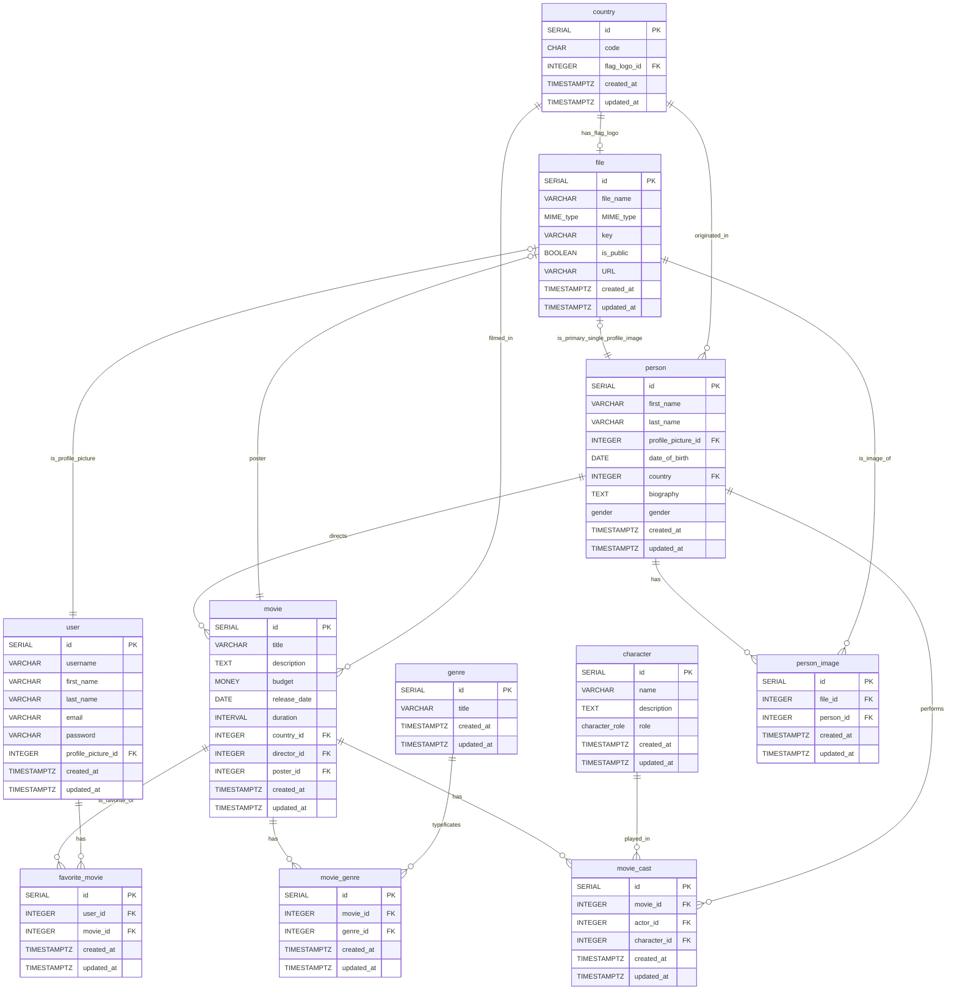

# JavaScript: Database and SQL assigment

This repository contains SQL scripts designed specifically for use with `PostgreSQL` databases.

## Database ER-diagram

```mermaid
erDiagram
    country ||--o| file : has_flag_logo
    person }o--|| country:  originated_in
    file |o--|| person : is_primary_single_profile_image
    file |o--|| user : is_profile_picture
    movie }o--|| country:  filmed_in
    person ||--o{ movie : directs
    file |o--|| movie : poster
    movie ||--o{ favorite_movie : is_favorite_of
    user ||--o{ favorite_movie : has
    movie ||--o{ movie_genre : has
    genre ||--o{ movie_genre : typeficates
    movie ||--o{ movie_cast : has
    character ||--o{ movie_cast : played_in
    person ||--o{ movie_cast : performs
    person ||--o{ person_image : has
    file ||--o{ person_image : is_image_of

    file {
        SERIAL id PK
        VARCHAR file_name
        MIME_type MIME_type
        VARCHAR key
        BOOLEAN is_public
        VARCHAR URL
        TIMESTAMPTZ created_at
        TIMESTAMPTZ updated_at
    }
    country {
        SERIAL id PK
        CHAR code
        INTEGER flag_logo_id FK
        TIMESTAMPTZ created_at
        TIMESTAMPTZ updated_at
    }
    person {
        SERIAL id PK
        VARCHAR first_name
        VARCHAR last_name
        INTEGER profile_picture_id FK
        DATE date_of_birth
        INTEGER country FK
        TEXT biography
        gender gender
        TIMESTAMPTZ created_at
        TIMESTAMPTZ updated_at
    }
    user {
        SERIAL id PK
        VARCHAR username
        VARCHAR first_name
        VARCHAR last_name
        VARCHAR email
        VARCHAR password
        INTEGER profile_picture_id FK
        TIMESTAMPTZ created_at
        TIMESTAMPTZ updated_at
    }
    movie {
        SERIAL id PK
        VARCHAR title
        TEXT description
        MONEY budget
        DATE release_date
        INTERVAL duration
        INTEGER country_id FK
        INTEGER director_id FK
        INTEGER poster_id FK
        TIMESTAMPTZ created_at
        TIMESTAMPTZ updated_at
    }
    character {
        SERIAL id PK
        VARCHAR name
        TEXT description
        character_role role
        TIMESTAMPTZ created_at
        TIMESTAMPTZ updated_at
    }
    favorite_movie {
        SERIAL id PK
        INTEGER user_id FK
        INTEGER movie_id FK
        TIMESTAMPTZ created_at
        TIMESTAMPTZ updated_at
    }
    genre {
        SERIAL id PK
        VARCHAR title
        TIMESTAMPTZ created_at
        TIMESTAMPTZ updated_at
    }
    movie_genre {
        SERIAL id PK
        INTEGER movie_id FK
        INTEGER genre_id FK
        TIMESTAMPTZ created_at
        TIMESTAMPTZ updated_at
    }
    movie_cast {
        SERIAL id PK
        INTEGER movie_id FK
        INTEGER actor_id FK
        INTEGER character_id FK
        TIMESTAMPTZ created_at
        TIMESTAMPTZ updated_at
    }
    person_image {
        SERIAL id PK
        INTEGER file_id FK
        INTEGER person_id FK
        TIMESTAMPTZ created_at
        TIMESTAMPTZ updated_at
    }
```
